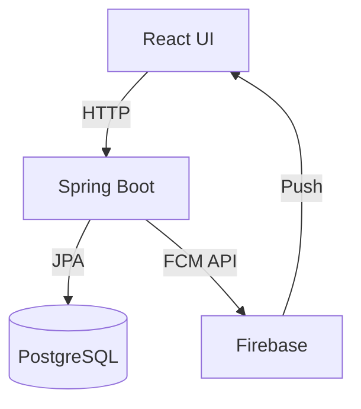
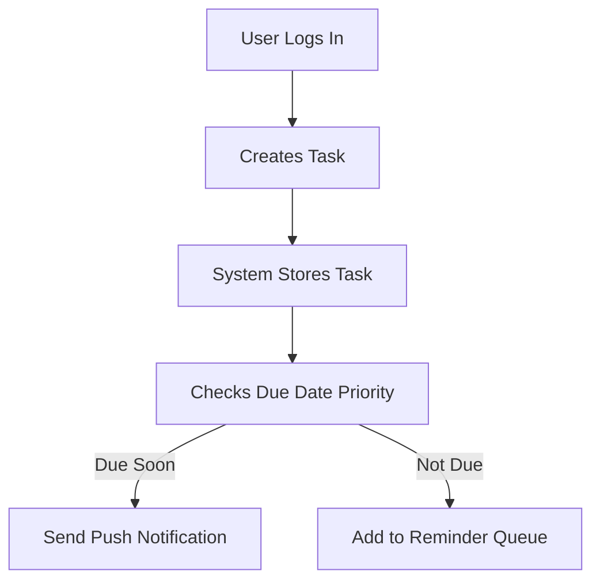
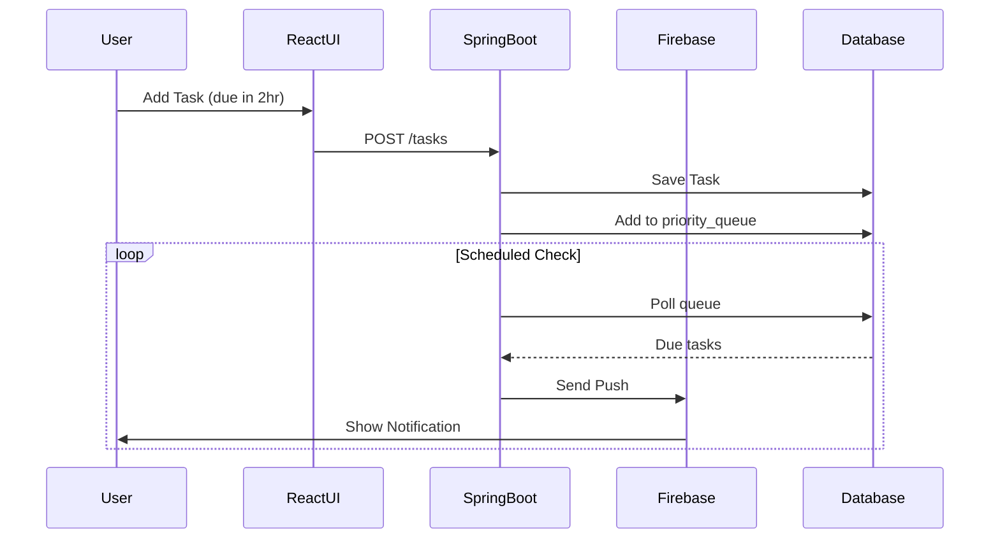
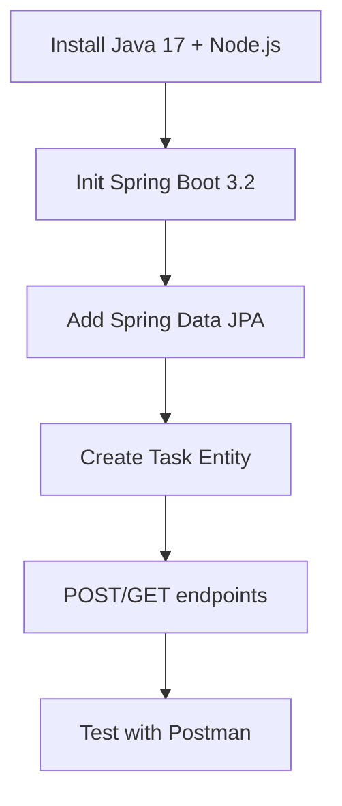
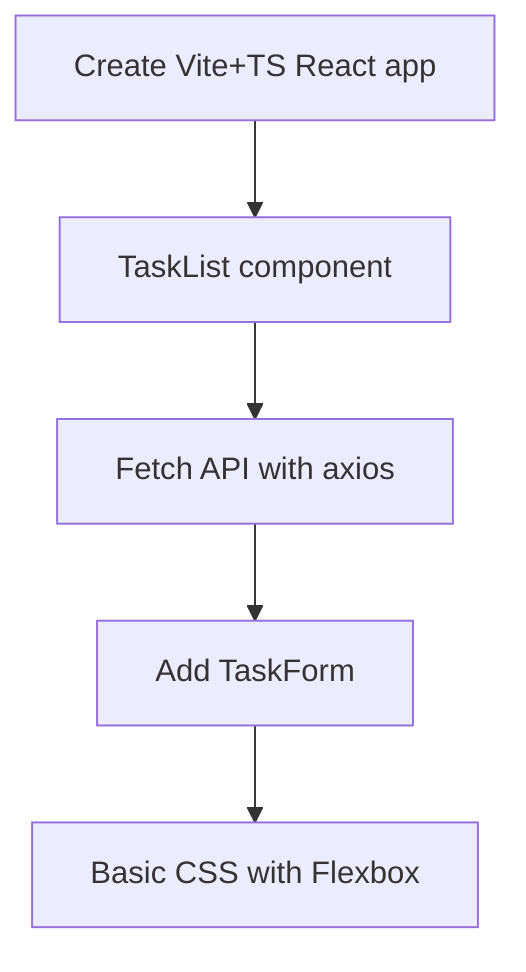
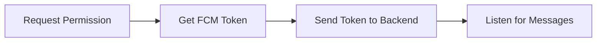
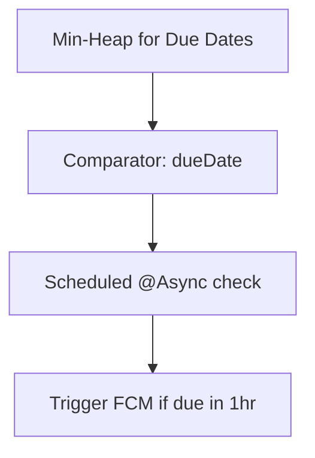
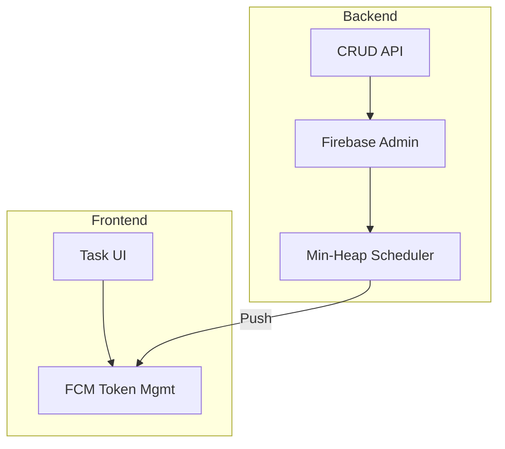

### **Project Title**
**"Task Tracker Pro"**  
*A CRUD app with real-time push notifications using Firebase*

### **Objective**
Assess Hilton’s ability to:
1. Learn new frameworks (Spring Boot/React) quickly
2. Apply data structure knowledge to backend logic
3. Implement modern full-stack patterns

---

### **Technical Scope**
| **Area**       | **Tech**               | **Why Chosen**                                                                 |  
|----------------|------------------------|--------------------------------------------------------------------------------|  
| **Frontend**   | React 18 + TypeScript  | Type safety aligns with Hilton’s DS strengths                                  |  
| **Backend**    | Spring Boot 3.2 (Java) | Strong typing + leverages Java knowledge                                      |  
| **Push**       | Firebase FCM           | Industry-standard, avoids complex WebSocket setup                              |  
| **Database**   | PostgreSQL             | Structured data fits CRUD needs                                               |  

---

### **Business Flow**
1. **User Story**  
   *"As a user, I want to create tasks and receive browser notifications when they’re due."*

2. **Key Operations**
   - **Create Task**: Title, description, due date
   - **Priority Queue**: Uses a **min-heap** (leveraging DS skills) to trigger reminders
   - **Notification**: Firebase push when due date is within 1 hour

---

### **Simplified Architecture**


---

### **Assessment Focus Areas**
#### **1. Backend (50% Weight)**
- **Data Structures**:
   - Min-heap implementation for due date prioritization
   - Efficient task filtering (e.g., by status)
- **Spring Boot**:
   - Clean `Controller -> Service -> Repository` flow
   - Firebase Admin SDK integration

#### **2. Frontend (30%)**
- **React Components**:
   - Task form with validation
   - Notification permission UX
- **TypeScript**:
   - Interfaces for Task/User models

#### **3. Firebase (20%)**
- Token management
- Error handling for failed pushes

---

### **Milestones & Timeline**
| **Prmx. Day** | **Task**                              | **Success Metric**                          |  
|---------------|---------------------------------------|---------------------------------------------|  
| ~1-2          | Basic Spring Boot CRUD API            | POST/GET tasks working                      |  
| ~3            | React frontend with task list         | API data renders in UI                      |  
| ~4            | Firebase setup + token storage        | Browser shows permission prompt             |  
| ~5            | Priority notifications               | Heap triggers FCM pushes on time            |  

---

### **Evaluation Rubric**
| **Skill**               | **Excellent (5pts)**                     | **Needs Work (2pts)**               |  
|-------------------------|------------------------------------------|-------------------------------------|  
| **Java/Spring Boot**    | Clean layered architecture               | Anemic domain model                 |  
| **React**              | Reusable components + hooks              | Prop drilling                       |  
| **Data Structures**     | Heap optimizes notification scheduling   | Brute-force sorting                 |  
| **Firebase**           | Handles token refresh edge cases         | No error logging                    |  

---

### **Support Provided**
1. **Starter Code**
   - Basic Spring Boot POM.xml with Firebase deps
   - React `vite` template with TypeScript

2. **Docs**
   - Firebase FCM setup guide
   - Spring Data JPA cheat sheet

3. **Mentorship**
   - 1hr daily check-ins for blockers

---

### **Expected Deliverables**
1. **Code**
   - Backend API with `/tasks` endpoints
   - React UI with notification toggle

2. **Demo**
   - Video showing:
      - Task creation → Firebase push
      - Priority-based reminders

3. **README**
   - How the min-heap optimizes notifications

---

### **Business Flow: Task Management System with Smart Notifications**
**Core User Journey**:


---

### **Step-by-Step Business Logic**

#### **1. Task Creation**
- **User Action**:
   - Fills form (Title, Description, Due Date)
   - Clicks "Save Task"
- **System Response**:
  ```java
  // Backend pseudo-code
  if (dueDate <= now + 1 hour) {
      firebaseService.sendPushNotification(
          user.getFcmToken(),
          "Task Due Soon!",
          task.getTitle()
      );
  } else {
      priorityQueue.add(task); // Min-heap sorted by dueDate
  }
  ```

#### **2. Notification Triggering**
- **Scheduled Check** (Every 30 minutes):
  ```python
  while (!priorityQueue.isEmpty() && queue.peek().dueDate <= now + 1 hour) {
      task = queue.poll();
      sendNotification(task); // Via Firebase
  }
  ```
- **User Receives**: Push Notification

#### **3. Task Update/Completion**
- **User Action**: Marks task as "Done"
- **System Response**:
   - Removes task from priority queue
   - Sends confirmation notification:  
     `"Completed: Task Title"`

---

### **Data Flow Diagram**


---

### **Key Business Rules**
| Rule | Implementation | Hilton's Focus Area |  
|------|---------------|---------------------|  
| Immediate notifications for tasks due within 1 hour | Firebase direct send | API integration |  
| Future reminders | Min-heap priority queue | Data structure optimization |  
| Notification retries (if failed) | Exponential backoff | Error handling |  

---

### **Metrics to Track**
1. **Notification Delivery Rate** (% of successful FCM pushes)
2. **Reminder Accuracy** (Notifications sent within ±5 mins of due time)
3. **User Actions** (Click-through rate on notifications)

---

### **Sample Test Cases**
| Scenario | Expected Result |  
|----------|----------------|  
| Create task due in 30 mins | Immediate notification |  
| Create task due tomorrow | Added to queue, notified 1hr before |  
| Mark task as done | Queue updated, no further notifications |  

---

This flow:  
✅ **Tests full-stack capabilities** (UI → API → DB → Firebase)  
✅ **Leverages Hilton's DS skills** (Heap-based scheduling)  
✅ **Simulates real-world logic** (Priority-based alerts)

---

### **Phase 1: Setup & Foundation (Day 1-2)**
**Goal**: Basic environment + CRUD backend


**Key Files**:
- `Task.java` (Entity with `id, title, description, dueDate, status`)
- `TaskController.java` (Basic CRUD endpoints)
- `application.properties` (DB config)

---

### **Phase 2: Frontend Scaffolding (Day 3)**
**Goal**: React UI to display tasks


**Key Components**:
- `TaskTable.tsx` (Lists tasks with sorting)
- `AddTaskModal.tsx` (Form with validation)

---

### **Phase 3: Firebase Integration (Day 4)**
**Goal**: Push notification system



**Critical Steps**:
1. Browser permission dialog
2. Token storage in `users` table
3. Spring Boot `FirebaseMessaging` call

---

### **Phase 4: Data Structures Showcase (Day 5)**
**Goal**: Priority-based notifications


**Code Highlight**:
```java
// In NotificationScheduler.java
PriorityQueue<Task> queue = new PriorityQueue<>(
    (a,b) -> a.getDueDate().compareTo(b.getDueDate())
);
```

---

### **Phase 5: Polish & Demo (Day 6)**
**Final Touches**:
- Notification click handlers
- Error logging
- 5-min demo recording showing:
   1. Task creation → Push notification
   2. Priority-based reminder

---

### **Flow Summary**


### **What You'll Evaluate at Each Phase**
| Phase | Key Skill Tested | Success Metric |  
|-------|------------------|----------------|  
| 1 | Spring Boot structure | API returns 200/400 properly |  
| 2 | React state management | UI updates without refresh |  
| 3 | Service integration | Notifications appear in browser |  
| 4 | DS application | Reminders fire chronologically |  

This flow ensures Hilton:  
✅ **Builds progressively** (no big bang integration)  
✅ **Applies DS knowledge** (heap for scheduling)  
✅ **Learns practically** (FCM = marketable skill)

